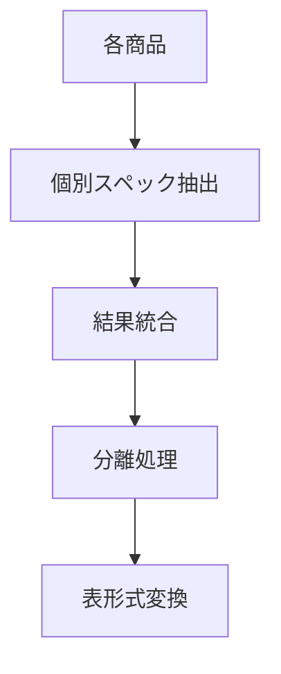

# 技術的分析: ECスペック抽出機能開発

## 概要分析

### 問題の本質
1. **401エラー問題**: 緊急（ブロッカー）
2. **スペック抽出最適化**: 戦略的機能開発（週20本制作体制への基盤）

## 1. 401エラー問題の技術分析

### 根本原因候補
1. **認証トークン期限切れ**
   - APIキー、セッション情報の失効
   - 解決時間: 30分〜1時間

2. **レート制限・ボット検出**
   - 過去事例（TKT-20250803-003）と同様パターン
   - 解決時間: 2-4時間（ヘッダー調整・間隔制御）

3. **ECサイト側仕様変更**
   - セキュリティポリシー強化
   - 解決時間: 4-8時間（代替手法実装）

### 即時対応策
- 過去解決事例の適用（User-Agent、ヘッダー設定）
- 異なる時間帯での再実行テスト
- 代替APIエンドポイントの検証

## 2. スペック抽出機能の技術設計

### 要求仕様の構造化

#### 入力
- 複数商品ページのURL配列
- 商品カテゴリ情報（液タブ等）

#### 出力（一覧表形式）
```
| グルーピングカテゴリ | 項目 | 値 | 商品URL |
|---|---|---|---|
| 表示性能 | 画面サイズ | 13.3インチ | https://... |
| 表示性能 | 解像度 | 1920×1080 | https://... |
| 接続性 | 入出力端子 | USB-C, HDMI | https://... |
```

### アーキテクチャ設計

#### 推奨アプローチ：パイプライン型処理


#### 1. 並列スペック抽出ステージ
```javascript
// 疑似コード
const extractSpecs = async (urls) => {
  return await Promise.all(
    urls.map(url => extractSpecFromPage(url))
  );
};
```

#### 2. データ正規化ステージ
- 各商品のスペック情報を共通フォーマットに変換
- 欠損データの補完
- 単位統一（cm → mm等）

#### 3. LLMグルーピングステージ
```yaml
prompt_template: |
  以下のスペック項目を意味のあるカテゴリでグルーピングしてください：
  
  項目: {spec_items}
  商品カテゴリ: {product_category}
  
  グルーピング例:
  - 表示性能: 画面サイズ、解像度、輝度
  - 接続性: 入出力端子、無線接続
  - 電源: 電源方式、バッテリー、消費電力
```

#### 4. 一覧表生成ステージ
- Markdown/HTML/CSV形式での出力
- URL付きでトレーサビリティ確保
- 統計情報の付加（傾向分析）

### 従来方法の問題点分析

#### 現在の問題


#### 問題点
1. **処理の複雑性**: 結合→分離の冗長フロー
2. **データ整合性**: 統合時の情報欠損リスク
3. **保守性**: ノード数が多く複雑化

### 最適化提案

#### 新アーキテクチャ


#### 技術的メリット
1. **シンプル化**: ノード数 50% 削減
2. **性能向上**: 並列処理による高速化
3. **データ品質**: 一貫した構造化処理
4. **拡張性**: 新商品カテゴリ対応容易

## 3. 実装計画

### Phase 1: 緊急対応（0.5日）
- [ ] 401エラーの根本原因特定・修正
- [ ] 既存スペック抽出機能の安定化

### Phase 2: コア機能開発（1.5日）
- [ ] 並列スペック抽出エンジン
- [ ] データ正規化ロジック
- [ ] LLMグルーピング機能

### Phase 3: UI/出力最適化（0.5日）
- [ ] 一覧表フォーマット実装
- [ ] URL付きトレーサビリティ
- [ ] 統計情報付加

### Phase 4: 統合テスト（0.5日）
- [ ] エンドツーエンドテスト
- [ ] 性能検証（週20本対応）
- [ ] エラーハンドリング強化

## 4. 技術的課題とリスク

### 高リスク項目
1. **スペック抽出精度**
   - 商品ページ構造の違い
   - 軽減策: 複数パターン対応、フォールバック処理

2. **LLMグルーピング品質**
   - カテゴリ分類の一貫性
   - 軽減策: プロンプト最適化、サンプル学習

3. **性能要件（週20本）**
   - 大量処理時の安定性
   - 軽減策: バッチサイズ調整、エラーリトライ

### 中リスク項目
1. **データフォーマット統一**
   - 単位系・表記揺れ
   - 軽減策: 正規化辞書、バリデーション強化

## 5. 成功指標（KPI）

### 機能要件
- [ ] 4カラム（カテゴリ・項目・値・URL）完全対応
- [ ] 商品数10〜50件での安定動作
- [ ] 処理時間: 5分以内/10商品

### 品質要件
- [ ] スペック抽出精度: 95%以上
- [ ] グルーピング一貫性: 90%以上
- [ ] エラー率: 5%未満

### 業務要件
- [ ] 週20本制作ワークフローへの統合完了
- [ ] 人的工数50%削減（編集作業簡素化）

## 6. 次期発展計画

### 構成作成との連携（将来）
- スペックデータの構成案への自動反映
- ニーズ×スペック掛け合わせロジック
- 見出し自動生成機能

この技術分析に基づき、緊急性を考慮した段階的実装により今週末の完成を目指します。