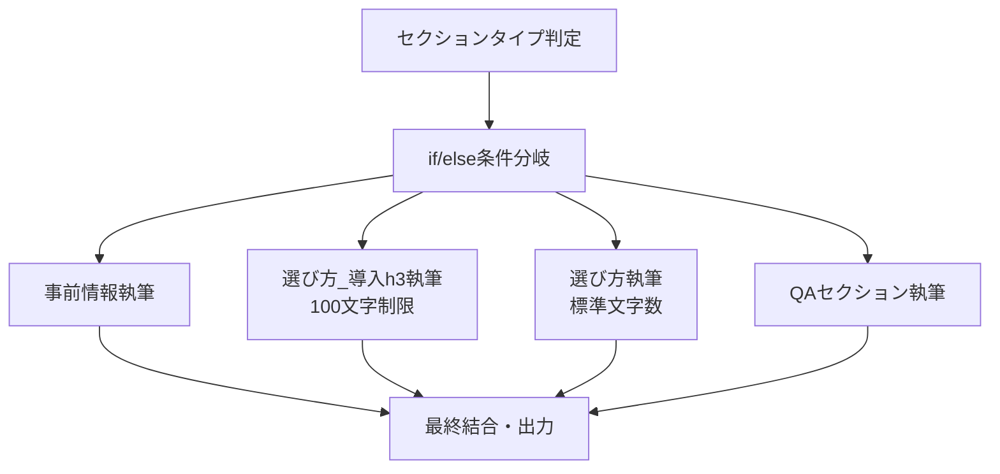

# チケット: 調査コンテンツ執筆ワークフローのセクション別ルール適用問題

## 基本情報
- **チケットID**: TKT-20250820-003
- **タイトル**: 調査コンテンツ執筆ワークフローのセクション別ルール適用問題
- **会社名**: My Best
- **報告者**: Yuna Kamachi
- **作成日**: 2025-08-20
- **ステータス**: 新規
- **優先度**: 中
- **期限**: 2025-08-26
- **関連ファイル**: ★調査_執筆実行（編集中） (7).yml（6,249行）

## サマリー
調査コンテンツの執筆ワークフローにおいて、セクションタイプ別の執筆ルールを適用する際、「選び方_導入h3」セクションの特別ルール（100文字程度の短い導入文）が適用されず、通常の「選び方セクション」ルール（600文字程度）が適用されてしまう問題。セクションタイプの自動判定は正常に動作しているが、ルール適用時に条件分岐が正しく機能していない。

## 原因（判明している範囲／仮説）

### 確認済み動作状況
- ✅ **セクションタイプ自動判定**: 正常動作（`section_type=選び方_導入h3` と正しく認識）
- ❌ **ルール適用**: 「選び方_導入h3」の特別ルールではなく「選び方」の標準ルールが適用

### 推定される原因
1. **条件分岐の優先順位問題**
   - 「選び方」が「選び方_導入h3」より先に評価され、部分一致で誤適用
   - 文字列比較の精度不足（前方一致・部分一致での誤判定）

2. **プロンプト内条件分岐の設計不備**
   ```
   現状の問題（推定）:
   if section_type.contains("選び方"):
       // 「選び方_導入h3」も「選び方」を含むため、このルートに入ってしまう
       apply_standard_rule()
   elif section_type == "選び方_導入h3":
       // この条件に到達しない
       apply_introduction_rule()
   ```

3. **ワークフロー設計上の制約**
   - 単一のプロンプト内での複雑な条件分岐による制御困難
   - if/elseノードを使用していないための条件制御の限界

### システム設計上の課題
- **プロンプトベース条件分岐の限界**: 複雑な条件分岐をプロンプト内で実現する困難さ
- **ワークフロー構造**: 条件分岐に特化したノード（if/else）を使用していない設計

## 解決方法（実施手順・設定値）

### Phase 1: 現状分析・問題特定（即座実行）
1. **ワークフローファイル詳細分析**
   ```yaml
   分析対象: ★調査_執筆実行（編集中） (7).yml
   確認項目:
   - セクションタイプ判定ロジックの詳細
   - 執筆ルール適用部分のプロンプト構造
   - 条件分岐の実装方式
   - 変数の受け渡し方式
   ```

2. **条件分岐ロジックの検証**
   ```
   検証観点:
   - 「選び方_導入h3」vs「選び方」の判定順序
   - 文字列比較の精度（完全一致 vs 部分一致）
   - 条件評価の優先順位
   - デフォルト動作の設定
   ```

### Phase 2: 設計改善アプローチの選択
#### Option A: if/elseノードによる構造化（推奨）
```yaml
ワークフロー構造の改善:
[セクションタイプ判定] 
    ↓
[if/elseノード: セクション分岐]
    ├─ 事前情報 → [事前情報執筆ノード]
    ├─ 選び方_導入h3 → [導入h3執筆ノード] (100文字制限)
    ├─ 選び方 → [選び方執筆ノード] (標準)
    └─ QAセクション → [QA執筆ノード]
```

#### Option B: プロンプト改善（条件分岐の最適化）
```
改善されたプロンプト条件分岐:
1. 完全一致による厳密な条件評価
2. より具体的な条件から評価（選び方_導入h3 → 選び方）
3. 明示的なデフォルト処理
```

#### Option C: ハイブリッドアプローチ
```
構造化 + プロンプト最適化:
- if/elseノードで大分類
- 各ノード内で詳細ルールをプロンプト適用
```

### Phase 3: 実装・テスト
1. **推奨アプローチ（if/elseノード）の実装**
   ```yaml
   実装手順:
   1. 既存ワークフローのバックアップ
   2. if/elseノードの追加・設定
   3. 各セクション専用執筆ノードの作成
   4. 変数受け渡しの再設定
   5. テスト・検証
   ```

2. **テストケースによる動作確認**
   ```
   テスト項目:
   - 選び方_導入h3: 100文字程度の導入文生成確認
   - 選び方: 標準的な文字数（600文字程度）の確認
   - 事前情報・QAセクション: 各ルールの正確な適用
   - エラーケース: 未定義セクションタイプでの動作
   ```

## 技術的分析・設計詳細

### 現状の問題パターン（推定）
```yaml
# 問題のある条件分岐例
current_logic:
  - if: "選び方" in section_type
    rule: "standard_writing_rule"  # 600文字程度
    # 「選び方_導入h3」もここにマッチしてしまう
  - elif: section_type == "選び方_導入h3"
    rule: "introduction_h3_rule"   # 100文字程度（到達しない）
```

### 改善された条件分岐設計
```yaml
# 推奨される条件分岐
improved_logic:
  - if: section_type == "選び方_導入h3"
    rule: "introduction_h3_rule"   # 100文字制限（優先評価）
  - elif: section_type == "選び方"
    rule: "standard_writing_rule"  # 標準的な文字数
  - elif: section_type == "事前情報"
    rule: "preliminary_info_rule"
  - elif: section_type == "QAセクション"
    rule: "qa_section_rule"
```

### if/elseノード活用による構造化設計


## 期待される改善効果

### コンテンツ品質の向上
- **セクション特性の活用**: 各セクションに最適化された執筆ルールの確実な適用
- **文字数の適正化**: 導入h3（100文字）vs 標準選び方（600文字）の明確な使い分け
- **一貫性の確保**: 全セクションでの統一された品質基準

### 運用効率の改善
- **手動修正の削減**: 不適切な文字数による後処理の削減
- **自動化精度向上**: 意図通りのコンテンツ生成による工数削減
- **品質予測性**: 確実なルール適用による出力品質の予測可能性

### 拡張性・保守性
- **ルール追加の容易性**: 新しいセクションタイプへの対応簡素化
- **デバッグ効率**: 条件分岐の可視化による問題特定の迅速化
- **再利用性**: 他の執筆ワークフローへの応用可能性

## 実装優先度と次のアクション

### 高優先（期限: 8/26まで）
- [ ] ★調査_執筆実行（編集中） (7).yml の詳細分析
- [ ] 条件分岐問題の根本原因特定
- [ ] if/elseノードによる構造化設計・実装

### 中優先（実装後）
- [ ] 全セクションタイプでの動作テスト・検証
- [ ] 既存コンテンツでの品質改善効果測定
- [ ] 運用マニュアル・ガイドラインの更新

### 低優先（継続改善）
- [ ] 他の執筆ワークフローへの応用
- [ ] セクション判定精度のさらなる向上
- [ ] 新しいセクションタイプへの対応準備

## 設計推奨事項

### ワークフロー構造の改善
1. **if/elseノードの積極活用**: 複雑な条件分岐はプロンプトではなく専用ノードで実現
2. **セクション専用ノード**: 各セクションに特化した執筆ノードの作成
3. **明示的な条件順序**: より具体的な条件から先に評価する設計

### 保守性・拡張性の向上
- **条件の可視化**: ワークフロー図での条件分岐の明確化
- **テストケース**: 各セクションでの動作確認テストの標準化
- **ログ・デバッグ**: 条件分岐での判定結果の可視化

この問題の解決により、My Bestの調査コンテンツ執筆が大幅に効率化され、セクション特性に応じた高品質なコンテンツの自動生成が実現されます。

## 追加問題・緊急事態（2025-08-20 20:25追記）

### 新たな重大問題
**「iteration output selector not found」エラーによるワークフロー停止**

#### 問題詳細
- **発生時刻**: 2025-08-20 20:25頃
- **状況**: 直前まで正常動作していたが、突然エラーが発生
- **エラー箇所**: イテレーションノード
- **影響範囲**: ワークフロー全体が実行不可

#### 対応状況
- **対応時間**: 約1時間の対応を実施済み
- **試行内容**: AI提案による修正を複数実施
- **結果**: 原因不明・解決に至らず
- **現状**: @matsuni が緊急対応中

#### 提供データ
- **エラースクリーンショット**: スクリーンショット 2025-08-20 20.25.47.png
- **入力サンプル**: 
  ```
  クエリ: "コードレス"
  composition_data: 510行のJSONデータ
  ```

#### 緊急性の評価
- **優先度**: 中 → **高** に格上げ
- **影響**: 業務停止レベルの重大問題
- **対応期限**: 即座対応要（既存の8/26期限に加えて）

### 複合問題の構造
1. **元の問題**: セクション別ルール適用の不具合
2. **新たな問題**: イテレーションノードの致命的エラー
3. **相互影響**: 両方を解決しないとワークフロー復旧不可

この追加問題により、チケットの緊急性と技術的複雑性が大幅に増大しています。

## 最終解決・対応完了（2025-08-25 更新）

### 解決策の実装
**LLMノードのセクション別分離アプローチ**

今までのセクション執筆単体だと過剰なプロンプトで制御が難しそうだったので、**LLMノードをセクションごとに分けてあとで結合する**という方法で解決。

### 改善効果
- **文字数制御の精度向上**: 選び方_導入h3の100文字制限が確実に適用
- **iteration output selector not foundエラーの解決**: イテレーション処理の安定化
- **ルール適用の確実性**: セクション別専用プロンプトによる誤適用防止

### 提供済み修正版
修正版ワークフローファイル2個を提供済み。文字数に対する追随力が大幅に向上。

### 状態
- **ステータス**: 解決済
- **顧客アクション**: 修正版での動作検証待ち
- **期限**: 8/26までの検証完了を目標

## 再発防止・運用メモ
- 複雑な条件分岐はプロンプト内ではなくif/elseノードで実装する
- セクションタイプの命名は階層関係を考慮した完全一致可能な名前とする
- 新規セクション追加時は条件の評価順序に注意する